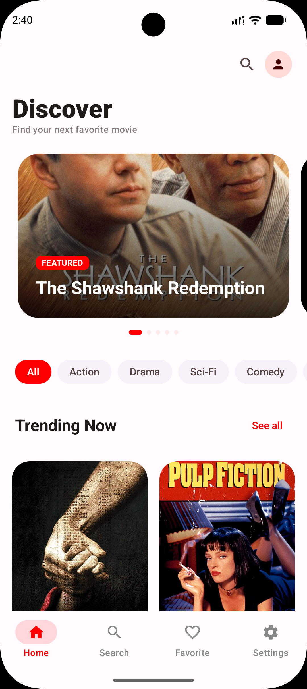
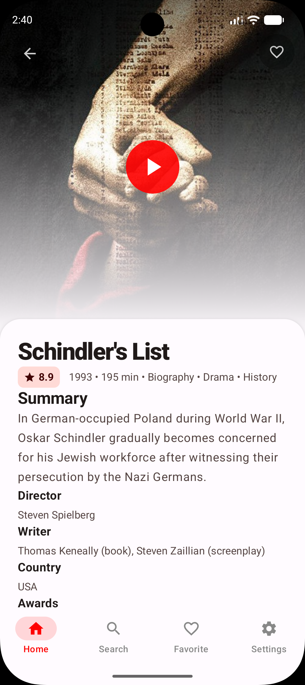
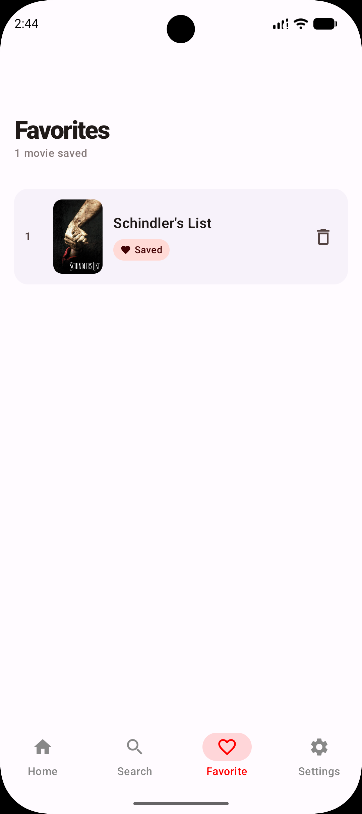
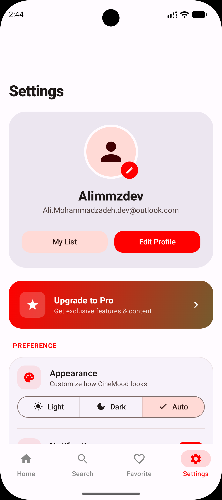
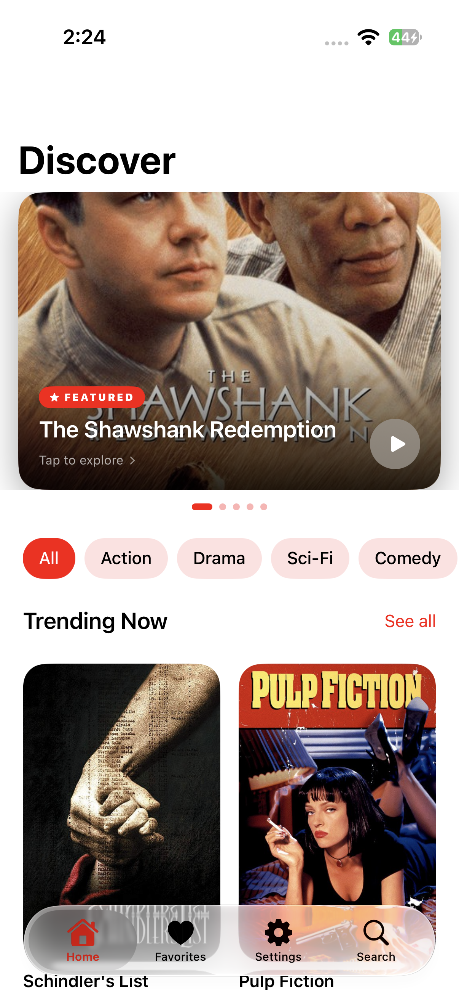
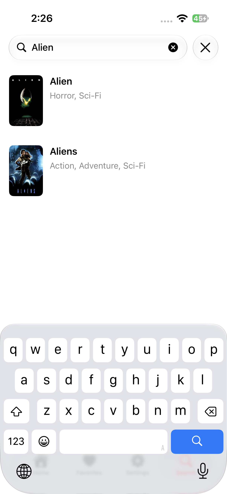
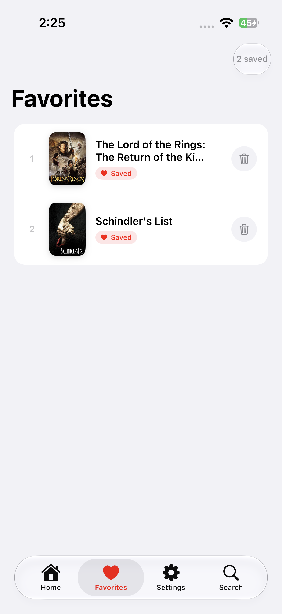
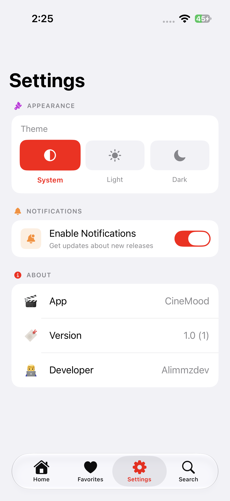
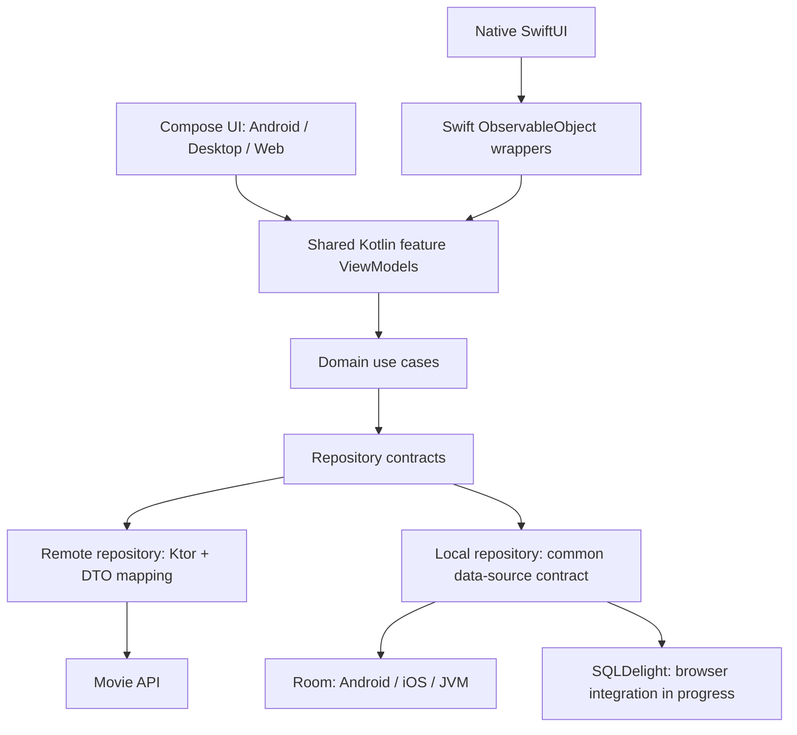

<div align="center">

# CineMood

**A Kotlin Multiplatform movie discovery app with shared Kotlin logic, Compose Multiplatform, and native SwiftUI.**

An Android-focused portfolio project exploring how modular architecture, reactive state, and platform integrations work across mobile, desktop, and web.

**Work in progress · Android · iOS · Desktop · Web**

[Website](https://cinemood.alimmz.dev) · [Screenshots](#screenshots) · [Explore the code](#code-tour) · [Current features](#current-features) · [Run locally](#run-locally) · [Development status](#development-status)

</div>

## Screenshots

### Compose Multiplatform

| Home | Movie details | Favorites | Settings |
| :---: | :---: | :---: | :---: |
|  |  |  |  |

### Native iOS · SwiftUI

| Home | Movie details | Search | Favorites | Settings |
| :---: | :---: | :---: | :---: | :---: |
|  |  |  |  |  |

## About the project

CineMood lets users browse a movie catalog, search for titles, inspect movie details, and save favorites. Movie data comes from the `moviesapi.ir` service configured in the remote data module.

I am building this project as a practical sample of my Android and Kotlin engineering skills: organizing a growing codebase, separating business logic from UI, managing asynchronous state, and integrating platform-specific services. Android, desktop, and web share a Compose UI; iOS uses native SwiftUI backed by the same Kotlin ViewModels and use cases.

The project is still under development. The sections below distinguish implemented behavior, compilation checks, and unfinished work so reviewers can assess the code as it stands.

## Engineering highlights

| Area | What the implementation demonstrates |
| --- | --- |
| **Modular architecture** | Separate feature, domain, data, and presentation modules. Repository contracts and use cases keep networking and database details out of feature ViewModels. |
| **Unidirectional state** | A shared MVI base with explicit `UiAction` inputs, immutable `UiState` values, and `StateFlow` updates. Features model loading, success, empty, and error states. |
| **Kotlin Multiplatform** | Shared models, use cases, repositories, and ViewModels, with `expect`/`actual` boundaries for HTTP engines, local database wiring, and system appearance. |
| **Native iOS integration** | An exported Kotlin `Shared` framework, Koin-backed ViewModel resolution, and Swift wrappers that publish Kotlin flow updates to SwiftUI. |
| **Data access** | Ktor requests, serialization, DTO-to-domain mapping, repository error handling, and reactive favorites storage behind a common data-source contract. |
| **UI composition** | Reusable Compose components, typed Navigation3 destinations, adaptive navigation, and shared movie-poster transitions between catalog and detail views. |
| **Build organization** | Gradle Kotlin DSL, a central version catalog, and source sets that share Room integration across Android, iOS, and JVM. |

## Current features

- **Browse movies:** featured carousel, poster grid, catalog pagination, and loading/error states with retry behavior. The featured and “Trending Now” sections use the catalog response; they do not use a separate recommendation or trending API.
- **Movie details:** poster, synopsis, available metadata, and a like/unlike action connected to the local data layer.
- **Search:** query-based API search with a 500 ms delay after typing, explicit submit/clear actions, and loading, empty, and error states. The current screen displays one results page.
- **Favorites:** database-backed likes and a reactive saved-movie list. Room implementations are present for Android, iOS, and desktop; browser storage integration is still being completed.
- **Appearance:** light, dark, and system theme selection, propagated through Compose and the SwiftUI app root. The preference is currently held in memory.
- **Navigation and motion:** bottom navigation or a navigation rail on Compose targets, shared poster transitions, and native SwiftUI tab navigation.
- **iOS genre filtering:** filters the currently loaded catalog. Compose genre chips currently update their selected appearance only.

## Architecture

The diagram shows the main runtime flow. The platform apps initialize dependencies, while shared feature ViewModels coordinate use cases and repositories.



| Module | Responsibility |
| --- | --- |
| `androidApp`, `desktopApp`, `webApp` | Platform entry points for the shared Compose application. |
| `iosApp` | Native SwiftUI screens, navigation, and observable ViewModel wrappers. |
| `shared` | App composition, Koin initialization, navigation host, theme coordination, and iOS framework exports. |
| `feature/home`, `search`, `favorite`, `settings` | Feature UI, state, actions, ViewModels, and dependency definitions. |
| `core/domain` | Shared contracts, result types, theme model, and flow-watching utility. |
| `core/data` | HTTP client configuration, platform engines, and theme repository implementation. |
| `core/presentation`, `core/navigation` | MVI base, reusable Compose components, appearance integration, and typed routes. |
| `service/domain` | Movie and favorite models, repository contracts, and use cases. |
| `service/data/iranianMoviesApi` | Remote data source, response DTOs, mapping, and movie repository implementation. |
| `service/data/local` | Favorites data source, Room entities/DAO, SQLDelight queries, and platform database setup. |

### Sharing state with SwiftUI

The iOS app starts Koin and resolves Kotlin ViewModels through `KoinHelper`. Each Swift `ObservableObject` wrapper watches the ViewModel's `StateFlow` using `FlowWatcher`, publishes state through `@Published`, and forwards user actions to Kotlin. Wrappers stop their flow watcher when deinitialized.

This keeps feature state and data access shared while allowing iOS to use SwiftUI views and native navigation. It also makes the boundary explicit: Swift wrappers adapt state for the UI, and Kotlin ViewModels own feature behavior.

## Code tour

These are useful starting points for a source review:

| Start here | What to look for |
| --- | --- |
| [MviViewModel](core/presentation/src/commonMain/kotlin/dev/alimmz/cinemood/core/presentation/mvi/MviViewModel.kt) | The small state/action abstraction used by feature ViewModels. |
| [HomeViewModel](feature/home/src/commonMain/kotlin/dev/alimmz/cinemood/feature/home/presentation/HomeViewModel.kt) | Catalog loading, pagination, and state reduction around use-case results. |
| [SearchViewModel](feature/search/src/commonMain/kotlin/dev/alimmz/cinemood/feature/search/presentation/SearchViewModel.kt) | Delayed query handling and explicit search states. |
| [MoviesRepositoryImpl](service/data/iranianMoviesApi/src/commonMain/kotlin/dev/alimmz/cinemood/service/data/iranianmoviesapi/repository/MoviesRepositoryImpl.kt) | Remote data mapping and error translation at the repository boundary. |
| [Local data module](service/data/local) | A common favorites contract with Room and SQLDelight implementations. |
| [HomeViewModelWrapper.swift](iosApp/iosApp/Presentation/Home/HomeViewModelWrapper.swift) and [KoinHelper](shared/src/iosMain/kotlin/dev/alimmz/cinemood/util/KoinHelper.kt) | The Kotlin-to-SwiftUI state and dependency bridge. |
| [App.kt](shared/src/commonMain/kotlin/dev/alimmz/cinemood/App.kt) | App-level navigation, adaptive layout, and shared-transition composition. |

## Technology

Versions below reflect the repository's [Gradle version catalog](gradle/libs.versions.toml).

| Purpose | Technology |
| --- | --- |
| Shared language | Kotlin 2.4.10 |
| Shared UI | Compose Multiplatform 1.11.1, Material 3 |
| iOS UI | SwiftUI |
| State and concurrency | Coroutines 1.11.0, Flow, AndroidX Lifecycle |
| Dependency injection | Koin 4.2.2 |
| Navigation | Navigation3 1.1.1 on Compose; SwiftUI navigation on iOS |
| Networking | Ktor 3.5.0, kotlinx.serialization 1.11.0 |
| HTTP engines | OkHttp on Android, Darwin on iOS, Java on JVM, JS for web |
| Local data | Room 2.8.4, SQLite, SQLDelight 2.3.2 |
| Images | Coil 3.4.0 on Compose; AsyncImage on SwiftUI |
| Build | Gradle 9.6.0, Android Gradle Plugin 9.1.1, KSP |

## Development status

Latest local compilation checks were performed on **September 24, 2026**. These are source compilation results, not release or end-to-end runtime certification.

| Target | UI | Latest local check |
| --- | --- | --- |
| Android | Compose Multiplatform | Debug Kotlin compilation passed. |
| Desktop JVM | Compose Multiplatform | Kotlin compilation passed. |
| Web JavaScript | Compose Multiplatform | Kotlin compilation passed; browser database behavior still needs validation. |
| iOS Simulator ARM64 | Native SwiftUI + shared Kotlin | Shared Kotlin compilation passed; this check did not build or run the SwiftUI app in Xcode. |
| Web WebAssembly | Compose Multiplatform | Compilation blocked by worker-type and suspend-call errors in the local database module. |

The repository currently contains starter/example tests. Meaningful ViewModel, repository, persistence, and UI coverage remains to be added.

### Next steps

- Complete browser database initialization and storage behavior, and resolve the WebAssembly compilation errors.
- Add tests for pagination, search timing, error handling, and favorite identity/removal behavior.
- Persist theme preferences across launches.
- Connect unfinished UI actions such as the home search shortcut and “See all,” and bring Compose genre filtering in line with iOS.
- Finish notification integration; the current toggle only updates UI state.
- Validate complete user journeys on each target and add reproducible CI checks.

Mood-based recommendations and movie playback are not implemented in the current project.

## Run locally

### Requirements

- JDK 21, as used for the local compilation checks, and the included Gradle wrapper.
- Android SDK Platform 37. The Android app has a minimum SDK of 24 and targets SDK 36. Set the SDK path through Android Studio or an untracked `local.properties` file.
- For iOS: macOS, Xcode with an SDK supporting the project's iOS 18.2 deployment target, and an ARM64 simulator or device.
- Network access for Gradle dependencies and the movie API. The current API client does not configure an API key.

```bash
git clone --branch dev https://github.com/Alimmzdev/CineMood.git
cd CineMood
```

### Android, desktop, and JavaScript

```bash
# Android: build a debug APK
./gradlew :androidApp:assembleDebug

# Android: install on a connected device or running emulator
./gradlew :androidApp:installDebug

# Desktop: run the Compose application
./gradlew :desktopApp:run

# JavaScript: start the browser development server
./gradlew :webApp:jsBrowserDevelopmentRun
```

The JavaScript command is a development entry point; its successful Kotlin compilation does not establish that the browser database works end to end. WebAssembly also has a configured `:webApp:wasmJsBrowserDevelopmentRun` task, but its compilation blocker must be resolved first.

### iOS

Open `iosApp/iosApp.xcodeproj` in Xcode, select the `iosApp` scheme and an ARM64 simulator, and run. For a physical device, configure your own signing team and provisioning settings.

The Xcode build phase invokes `:shared:embedAndSignAppleFrameworkForXcode` to build and embed the Kotlin `Shared` framework. Its targets are `iosArm64` and `iosSimulatorArm64`.

### Reproduce the passing Kotlin compilation checks

```bash
./gradlew :androidApp:compileDebugKotlin :desktopApp:compileKotlin \
  :webApp:compileKotlinJs :shared:compileKotlinIosSimulatorArm64
```

Run the combined command on macOS with the iOS toolchain available. It does not run automated tests or compile the SwiftUI application.

## AI-assisted development

I used AI-assisted development to build and iterate on the native SwiftUI layer, including views, navigation, theming, and Kotlin ViewModel wrappers. This project is also an exercise in learning an unfamiliar platform while applying architecture patterns from Android development. The iOS implementation should be understood in that context when reviewing my experience.

## Author

Built by [Alimmzdev](https://github.com/Alimmzdev). I am interested in Android and Kotlin Multiplatform opportunities and welcome technical feedback on the project.

## License

Source code is available under the [MIT License](LICENSE). Third-party dependencies and movie data retain their respective licenses and terms.
